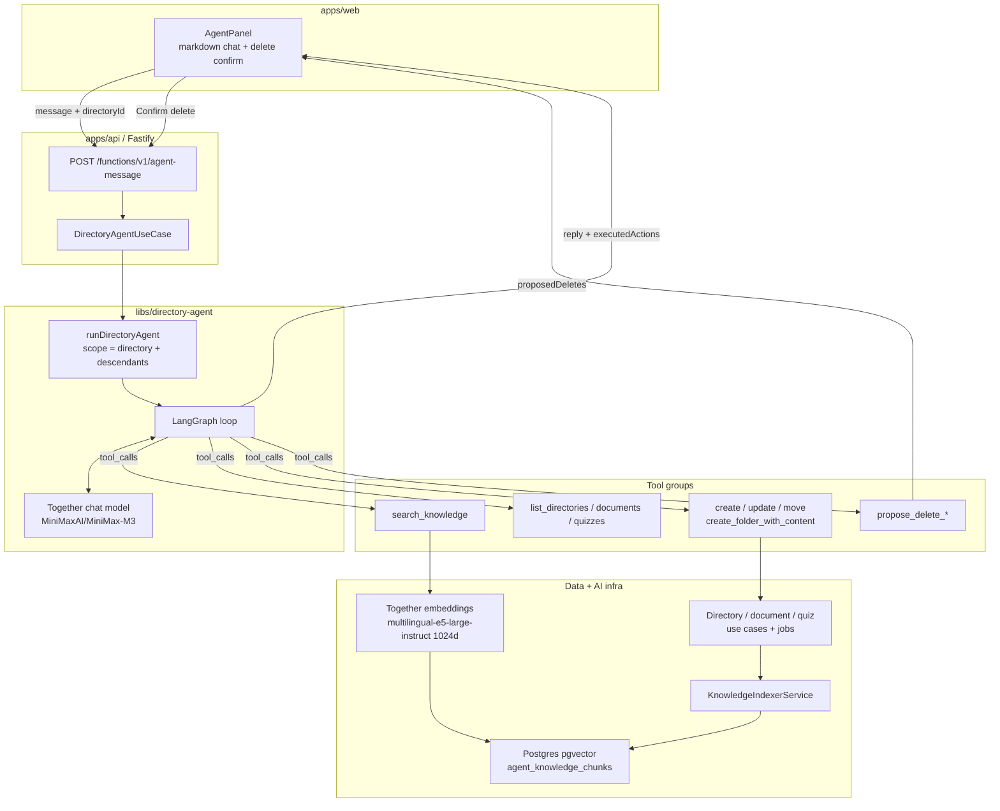

# sf-next-supabase

Nx monorepo for organizing study content in directories, generating documents and quizzes with AI, and chatting with a folder-scoped agent backed by RAG.

- `apps/web` — Next.js frontend
- `apps/api` — Dockerized Fastify backend (replaces Deno Edge Functions)
- `supabase/` — Supabase CLI project (migrations, RLS, Realtime, local stack)
- `libs/shared-types` — shared TypeScript contracts and Zod schemas
- `libs/validation` — Zod re-exports and text-to-HTML helpers
- `libs/storage-paths` — Supabase Storage path helpers
- `libs/document-agent` — LangGraph document generation agent
- `libs/directory-agent` — LangGraph directory agent (CRUD tools + RAG)
- `libs/api-*` — layered Fastify backend libraries (domain, application, infra, routes)

## Features

- **Directories** — nested folders for sources, quizzes, and rules inheritance
- **AI document & quiz generation** — Together AI (`MiniMaxAI/MiniMax-M3`), run as async jobs
- **Supabase Realtime** — live generation job status updates in the UI (pending → completed/failed)
- **Directory Agent** — creates and manages learning content (folder-scoped chat with search, CRUD tools, and delete confirmation)
- **RAG + vector search** — pgvector embeddings (`agent_knowledge_chunks`) via Together (`intfloat/multilingual-e5-large-instruct`, 1024d)
- **Rules** — reusable prompts attached to directories and applied during generation
- **Quizzes** — MCQ flows with scoring, hints, and explanations
- **Auth + RLS** — Supabase Auth with row-level security on user data

## Prerequisites

- Node.js 20+
- Yarn 1.x
- Docker (for local Supabase and production API image)
- Supabase CLI (`yarn supabase` or global install)
- Together AI API key

## Setup

```bash
yarn install
cp .env.example .env.local
```

Start Supabase locally:

```bash
yarn supabase:start
```

Copy the `anon`, `service_role`, and **Storage (S3)** credentials from the CLI output into `.env.local`.

Set your Together AI API key (`TOGETHER_AI_API_KEY`) in `.env.local`.

Start the Fastify API:

```bash
yarn dev:api
```

Start the web app:

```bash
yarn dev:web
```

Open [http://localhost:4200](http://localhost:4200) (or the port shown by Nx).

## App Flow

1. Sign up or sign in
2. Create directories and add sources (document generation runs as a background job; status streams via Realtime)
3. Generate quizzes from documents (also async jobs)
4. Open a directory **Agent** tab to ask questions or manage folder content with RAG-backed tools
5. Take quizzes and review explanations

There is no separate dashboard — authenticated users land on the directories/documents page.

## Useful Commands

```bash
yarn dev:web                     # Start Next.js app
yarn dev:api                     # Start Fastify API on port 3001
yarn nx run supabase:start       # Start local Supabase
yarn nx run supabase:push        # Apply pending migrations to local DB
yarn nx run supabase:reset       # Reset local DB and reapply all migrations
yarn nx run supabase:push-remote # Push migrations to linked remote project
yarn supabase:gen-types          # Regenerate Database types from local schema
yarn backfill:knowledge <userId> # Re-index directories/documents/quizzes for RAG
yarn test:supabase               # Run Supabase RLS integration tests
yarn nx run api:build            # Bundle Fastify API for production
yarn test                        # Run unit tests
yarn lint                        # Lint all projects
yarn build                       # Build all projects
```

## Architecture

- **Postgres** — directories, documents, quizzes, rules, generation jobs, and `agent_knowledge_chunks` (pgvector)
- **Supabase Storage** — document HTML (S3-compatible API)
- **Supabase Auth + RLS** — users only access their own records
- **Supabase Realtime** — generation job row changes pushed to the web client
- **Fastify API** — authenticated mutations at `/functions/v1/*` (create, generate, agent-message, CRUD)
- **Together AI** — chat/completions for generation and agent reasoning; embeddings for RAG
- **LangGraph agents** — `document-agent` for document HTML; `directory-agent` for folder-scoped tool use and retrieval

### Directory agent



- Embeddings use Together serverless model `intfloat/multilingual-e5-large-instruct` (1024 dimensions)
- Chunks are scoped to the current directory and its descendants
- Deletes proposed by the agent require UI confirmation; create/update/move execute immediately
- Document generation can optionally queue quiz generation after the document job completes
- LangGraph stops when the model returns no tool calls, or when the tool-round / recursion limits are hit

## Environment Variables

See [`.env.example`](.env.example) for the full list.

The web client uses `NEXT_PUBLIC_API_URL` (default `http://127.0.0.1:3001`) and calls `${NEXT_PUBLIC_API_URL}/functions/v1/*` for mutations.

Optional agent tuning:

- `TOGETHER_EMBEDDING_MODEL` — override embedding model (default multilingual-e5-large-instruct)
- `DIRECTORY_AGENT_RECURSION_LIMIT` — LangGraph recursion limit (default `50`)
- `DIRECTORY_AGENT_MAX_TOOL_ROUNDS` — max tool rounds per turn (default `15`)

## Docker

Build and run the API container:

```bash
docker build -f apps/api/Dockerfile -t sf-api .
docker run --env-file .env.local -p 3001:3001 sf-api
```
